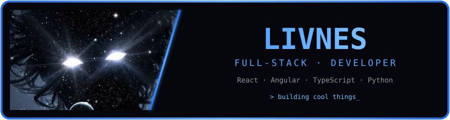
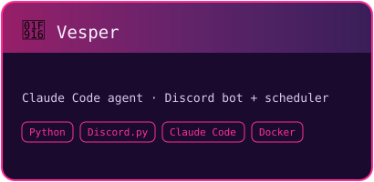
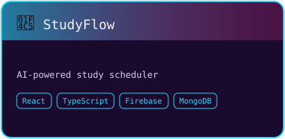
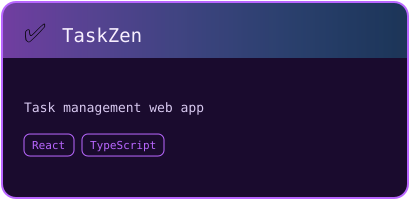
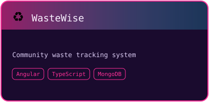
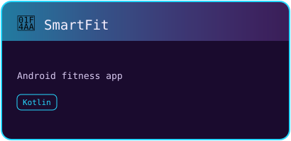
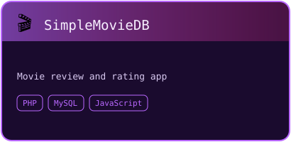
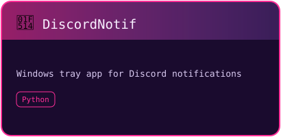

<!-- ===================== 1. HEADER ===================== -->

- 🌱 Currently learning **Docker** and expanding my DevOps knowledge
- 💼 Previously interned as a Frontend Developer at **Biztory Cloud** (May–Jul 2025)
- 🎓 Diploma in IT at **HELP University** · CGPA 3.56

<!-- ===================== 2. TECH STACK ===================== -->

<!-- ===================== 3. PROJECTS ===================== -->

*"Turning ideas into interfaces, one commit at a time."*

<!-- ===================== 4. EXPERIENCE ===================== -->

**Frontend Developer Intern** · Biztory Cloud · Puchong, Malaysia
`May 2025 – Jul 2025`
- Enhanced website features to improve user experience
- Used Git for version-controlled collaborative development

<!-- ===================== 5. CERTIFICATIONS ===================== -->

- Oracle Academy — Database Programming
- Oracle Academy — Database Design

<!-- ===================== 6. GITHUB STATS & GRAPHS ===================== -->

<table>
<tr>
<td width="50%">

</td>
<td width="50%">

</td>
</tr>
</table>

<!-- ===================== 7. SPOTIFY ===================== -->

<!-- ===================== 8. LET'S CONNECT ===================== -->

*Always learning, always building*

